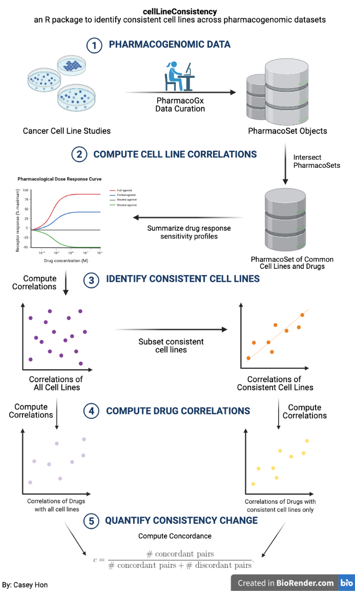

<!-- README.md is generated from README.Rmd. Please edit that file -->

# cellLineConsistency

<!-- badges: start -->
<!-- badges: end -->

## Description

Cancer cell lines are the most commonly used models in cancer biology
studies for validating cancer targets and defining drug efficacy.
`cellLineConsistency` provides a workflow in identifying cancer cell
lines that have consistent drug sensitivity measures, like the
half-maximal inhibitory concentration (IC50) and the area above the dose
response curve (AAC), across pharmacogenomic datasets. It extends the
`PharmacoGx` package, which contains the large-scale pharmacogenomic
experiment data of cancer cell lines and oncogenic drugs, such as the
Cancer Cell Line Encyclopedia and the Genomics of Drug Sensitivity in
Cancer Project, and tools to analyze their drug-dose response and/or
molecular features. In extension of the `PharmacoGx` tools,
`cellLineConsistency` provides a way to quantify which cell lines have
consistent drug sensitivity data across datasets using correlation
coefficients, such as Pearson’s correlation coefficient, Spearman’s rank
correlation coefficient, and Kendall’s rank correlation. It also
includes a plotting tool to visualize the comparison of correlations
between cell lines and/or drugs. In turn, `cellLineConsistency` offers
users a quantifiable way to identify which cell lines are dependable for
use in further studies.

This package was developed in R version 4.0.0 on a Mac platform.

## Installation

You can install the development version of `cellLineConsistency` from
[GitHub](https://github.com/) with:

``` r
require("devtools")
devtools::install_github("honcasey/cellLineConsistency", build_vignettes = TRUE)
library("cellLineConsistency")

To run the shinyApp:
Under construction
```

## Overview

``` r
ls("package:cellLineConsistency")
```

`cellLineConsistency` contains 6 functions that can be used in
identifying and quantifying consistent cancer cell lines. The
*intersectSensMeasures* function identifies sensitivity measures common
to all datasets of interest. The *computeCellLineCorrelation* function
computes correlation coefficients of cell line drug sensitivity measures
across datasets. The *computeDrugCorrelation* function computes
correlation coefficients by drugs across datasets. The
*getConsistentCellLines* function subsets cell lines deemed as
consistent based on a user-specified minimum correlation. The
*computeConcordance* function computes Harrell’s Concordance Index to
quantify improvement in consistency between the correlations of the
original and subsetted cell lines. *plotCorrelations* generates a
barplot to compare cell line/drug correlations. Refer to package
vignette for more details.

``` r
browseVignettes("cellLineConsistency")
```

An overview of the package is illustrated below.



## Contributions

The author of the package is Casey Hon. All functions make use of the
`PharmacoGx` S4 *PharmacoSet* R objects, which is a class developed to
contain and organise large pharmacogenomic datasets to simplify
metaanalyses. The `stats` R package is used for computing correlation
coefficients (e.g. Pearson, Spearman, and Kendall) in
*computeCellLineCorrelation* and *computeDrugCorrelation*. The
`survival` R package is used for computing Harrell’s Concordance Index
in *computeConcordance*. The `graphics` R package is used in
*plotCorrelations*.

## References

Barretina J, Caponigro G, Stransky N, Venkatesan K, Margolin A, Kim S,
Wilson C, Lehár J, Kryukov G, Sonkin D, et al., (2012). The Cancer Cell
Line Encyclopedia enables predictive modelling of anticancer drug
sensitivity. *Nature*. 483(7391), 603-7.

R Core Team (2021). R: A language and environment for statistical
computing. R Foundation for Statistical Computing, Vienna, Austria.
<https://www.R-project.org/>

Smirnov P, Safikhani Z, El-Hachem N, Wang D, She A, Olsen C, Freeman M,
Selby H, Gendoo D, Grossman P, Beck A, Aerts H, Lupien M, Haibe-Kains
AG, (2016). PharmacoGx: an R package for analysis of large
pharmacogenomic datasets. *Bioinformatics (Oxford, England)*.

Therneau T (2021). A Package for Survival Analysis in R. R package
version 3.2-13, <https://CRAN.R-project.org/package=survival>.

Wickham, H and Bryan, J (2019). *R Packages* (2nd edition). Newton,
Massachusetts: O’Reilly Media. <https://r-pkgs.org/>

Yang W, Soares J, Greninger P, Edelman EJ, Lightfoot H, Forbes S, Bindal
N, Beare D, Smith JA, Thompson IR, Ramaswamy S, Futreal PA, Haber DA,
Stratton MR, Benes C, McDermott U and Garnett MJ, (2013). Genomics of
Drug Sensitivity in Cancer (GDSC): a resource for therapeutic biomarker
discovery in cancer cells. *Nucleic acids research*. 41(D1), D955-D961.

## Acknowledgements

This package was developed as part of an assessment for 2021 BCB410H:
Applied Bioinformatics, University of Toronto, Toronto, CANADA.
