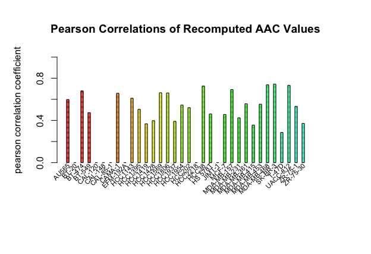

```{r setup, include = FALSE}
library(cellLineConsistency)

```

## Introduction
Cancer cell lines are the most commonly used models in cancer biology studies for validating cancer targets and defining drug efficacy. Given that patients have such differing responses to the drugs with widely varying effects, there has been an increasing interest in the shift of medicine from a population-level to patient-specific level, particularly focused on identifying biomarkers of treatment response. By understanding how to leverage genotype for predicting drug response at an individual level, treatment plans can be aimed at prescribing the right drug at a dose that causes minimal toxicity. 

One challenge of oncogenic biomarker identification lies in contradictory results from past studies, which have recorded different outcomes from exposure of a same set of cancer cells to the same treatment (Güvenç Paltun et al., 2019). Pharmacogenomics allows for identifying the genomic variants that cause different responses to a particular treatment. These differing responses can be quantified by drug sensitivity measures such as “half maximal inhibitory concentration” (IC50) and “Area Above the Curve” (AAC), which allow for analyzing responses to a range of anticancer agents at variable doses.

Several experiments outlining drug dose response profiles of cancer cell lines have been conducted, such as the Cancer Cell Line Encyclopedia (CCLE) (Barretina et al., 2012) and the Genomics of Drug Sensitivity in Cancer Project (GDSC) (Yang et al., 2013). The *PharmacoGx* package was developed to simplify metaanalyses by standardizing data organization for large, publicly available, cancer cell line datasets (Smirnov et al., 2016). An overlap between the common cell lines and drugs in studies based on the data from GDSC and CCLE has allowed for the assessment of drug sensitivity consistency across the datasets. However, no package exists to standardize the computation of consistency values, which hinders our ability to know how dependable the information derived from these cell lines is.

`cellLineConsistency` is an R package developed to identify cancer cell lines that have consistent drug sensitivity measures, and provide a quantifiable measure of consistency using a concordance index. The package is targeted for pharmacogenomics researchers looking to use cancer cell line studies, and would like a quantifiable measure of how consistent the cell lines are across datasets. At the moment, consistency analyses can only be done on existing datasets from PharmacoGx. However, PharmacoGx contains an extensive and up to date list of over 20 large-scale pharmacogenomic datasets.

'cellLineConsistency' contains 6 functions that can be used in identifying and quantifying consistent cancer cell lines. The *intersectSensMeasures* function identifies sensitivity measures common to all datasets of interest. The *computeCellLineCorrelation* function computes correlation coefficients of cell line drug sensitivity measures across datasets. The *computeDrugCorrelation* function computes correlation coefficients by drugs across datasets. The *getConsistentCellLines* function subsets cell lines deemed as consistent based on a user-specified minimum correlation. The *computeConcordance* function computes Harrell's Concordance Index to quantify improvement in consistency between the correlations of the original and subsetted cell lines. *plotCorrelations* generates a barplot to compare cell line/drug correlations. Refer to package vignette for more details.

**This document gives a tour of cellLineConsistency (version 0.1.0) functionalities**. It was written in R Markdown, using the [knitr](https://cran.r-project.org/package=knitr) package for production. 

See `help(package = "cellLineConsistency")` for further details.

To download **cellLineConsistency**, use the following commands:

``` r
require("devtools")
install_github("honcasey/cellLineConsistency", build_vignettes = TRUE)
library("cellLineConsistency")
```
To list all sample functions available in the package:
``` r
ls("package:cellLineConsistency")
```
<br>

## Details
Correlation Coefficients like Pearson, Spearman, and Kendall correlations can be used to quantify the linear association between drug sensitivity measures across datasets. Thus, by computing the correlations between datasets for each cell line, we can identify which cell lines had poor consistency, as defined by having a correlation coefficient of less than 0.5 (or another value which can be specified by the user). Then, by removing these inconsistent cell lines, the consistency of cell line drug sensitivity measures across datasets should improve. To quantify this improvement, we use Harrell's C-index and provide a concordance measure.

Here is an example workflow to identify consistent cell lines between the CTRPv2 (Seashore-Ludlow et al., 2015; Rees et al., 2016) and GRAY (Daemen et al., 2013; Hafner et al., 2017) PharmacoSets. Specifically, we want to see how the recomputed Area Above the Curve (aac_recomputed) values of the common cell lines between CTRP and GRAY compare across the two datasets, get the list of which cell lines are consistent, and quantify how consistency changes when we remove the inconsistent cell lines.

First, we use the *PharmacoGx* package to download and intersect the two PharmacoSets based on their common cell lines and drugs. If the user has specific cell lines or drugs of interest before downloading the PharmacoSets, these should be specified at this step using the *cell* or *drug* parameters in the *intersectPSet()* function. At the moment, downloading PharmacoSets must be done outside of the Shiny app due to large file size, but they are downloadable in the R package.

``` r
library(PharmacoGx)
# Intersect PharmacoSets of interest based on common drugs and cell lines
CTRP <- PharmacoGx::downloadPSet("CTRPv2_2015")
GRAY <- PharmacoGx::downloadPSet("GRAY_2013")
intersected <- PharmacoGx::intersectPSet(c(CTRP, GRAY),
    intersectOn = c("drugs", "cell.lines"))
View(intersected)
```
There are 35 drugs and 34 cell lines in common between CTRP and GRAY.
Next, we want to compute the Pearson Correlation Coefficient of the recomputed AAC values for each common cell line using *computeCorrelation*. We also want to get the associated p-values, so we set pval to TRUE.

``` r
cellLineCorrelations <- computeCellLineCorrelation(pSet = intersected, 
    coefs = "pearson", 
    sensMeasures = "aac_recomputed",
    pval = TRUE)
View(cellLineCorrelations)
``` 
Based on the returned messages in the console, a couple of cell lines did not have enough observations to compute a correlation. This means there was not enough drug response data in the experiment, which is okay - we just leave these as NA.
Next, we want the subset of cell lines that are deemed consistent. We'll use the default minimum value of 0.5, as defined in the *getConsistentCellLines* function. This means that only cell lines that have a Pearson correlation coefficient of 0.5 or larger will be considered consistent across CTRP and GRAY.
``` r
consistentLines <- getConsistentCellLines(cellLineCorrelations,
    sensMeasure = "aac_recomputed_corrs", 
    coefName = "pearson")
View(consistentLines)
```
Now we have a subsetted dataframe of the Pearson correlations and p-values of only the consistent cell lines. Out of the initial 34 cell lines we started with, 17 had a Pearson coefficient of at least 0.5. 
Next, we want to compute the Pearson correlation coefficients of the recomputed AAC values, but this time for each drug [instead of each cell line]. First we want the correlations of each drug when we include all 34 initial cell lines, and then the correlations of each drug when we include only the 17 consistent cell lines. We do so so that we can see how much of an improvement in consistency we get, which we will quantify later on. We use *computeDrugCorrelation* to get correlations of each drug.
``` r
drugAllCorrelations <- computeDrugCorrelation(pSet = intersected,
    coefs = "pearson",
    sensMeasures = "aac_recomputed")
drugConsistentCorrelations <- computeDrugCorrelation(pSet = intersected,
    cellLines = rownames(consistentLines),
    coefs = "pearson",
    sensMeasures = "aac_recomputed")
View(drugAllCorrelations[["aac_recomputed_corrs"]])
View(drugConsistentCorrelations[["aac_recomputed_corrs"]])
```
Now we have two dataframes that outline the correlations of each drug, with drugAllCorrelations outlining correlations when we include all 34 initial cell lines, and drugConsistentCorrelations outlining correlations when we only include the 17 consistent cell lines. We can see some differences between the Pearson correlation coefficients between the two. But how do we quantify this change as a whole, rather than looking at the difference in coefficients? We can use the concordance index to do so with *computeConcordance*.

``` r
concordance <- computeConcordance(allCorrelations = drugAllCorrelations,
    subsettedCorrelations = drugConsistentCorrelations,
    sensMeasure = "aac_recomputed_corrs",
    coefName = "pearson")
View(concordance)
```
Finally, we have a quantifiable value of 0.8, with 454 concordant pairs and 107 discordant pairs after we removed the inconsistent cell lines. Since the concordance is closer to 1, we know that the remaining cell lines have pretty high consistency across the two datasets. Thus, we can have confidence in using these 17 cell lines for further studies.

## Plotting
To visualize the correlations, we can use *plotCorrelations*.
```r
plotCorrelations(correlations = drugAllCorrelations$aac_recomputed_corrs,
    coefficient = "pearson",
    title = "Pearson Correlations of Recomputed AAC Values")
```


<br>

## References
* Barretina J, Caponigro G, Stransky N, Venkatesan K, Margolin A, Kim S, Wilson C, Lehár J, Kryukov G, Sonkin D, et al., (2012). The Cancer Cell Line Encyclopedia enables predictive modelling of anticancer drug sensitivity. *Nature*. 483(7391), 603-7.

* Daemen A, Griffith OL, Heiser LM, Wang NJ, Enache OM, Sanborn Z, Pepin F, Durinck S, Korkola JE, Griffith M, Hur JS, Huh N, Chung J, Cope L, Fackler MJ, Umbricht C, Sukumar S, Seth P, Sukhatme VP, Jakkula LR, Lu Y, Mills GB, Cho RJ, Collisson EA, van't Veer LJ, Spellman PT, Gray JW (2013). Modeling precision treatment of breast cancer. *Genome Biol*. 14(10), R110. doi: 10.1186/gb-2013-14-10-r110.

* Güvenç Paltun, B., Mamitsuka, H. & Kaski, S (2019). Improving drug response prediction by integrating multiple data sources: matrix factorization, kernel and network-based approaches. *Briefings in Bioinformatics*. doi:10.1093/bib/bbz153.

* Hafner M, Heiser LM, Williams EH, Niepel M, Wang NJ, Korkola JE, Gray JW, Sorger PK (2017). Quantification of sensitivity and resistance of breast cancer cell lines to anti-cancer drugs using GR metrics. *Sci Data*. 4(170166). doi: 10.1038/sdata.2017.166. 

* Haibe-Kains, B (2021). CTRPv2. *Zenodo*. doi:10.5281/zenodo.4429239.

* Haibe-Kains, B (2020). GRAY. *Zenodo*. doi:10.5281/zenodo.3905454.

* Rees MG, Seashore-Ludlow B, Cheah JH, Adams DJ, Price EV, Gill S, Javaid S, Coletti ME, Jones VL, Bodycombe NE, Soule CK, Alexander B, Li A, Montgomery P, Kotz JD, Hon CS, Munoz B, Liefeld T, Dančík V, Haber DA, Clish CB, Bittker JA, Palmer M, Wagner BK, Clemons PA, Shamji AF, Schreiber SL (2016). Correlating chemical sensitivity and basal gene expression reveals mechanism of action. *Nat Chem Biol*. 12(2):109-16. doi: 10.1038/nchembio.1986. 

* Seashore-Ludlow B, Rees MG, Cheah JH, Cokol M, Price EV, Coletti ME, Jones V, Bodycombe NE, Soule CK, Gould J, Alexander B, Li A, Montgomery P, Wawer MJ, Kuru N, Kotz JD, Hon CS, Munoz B, Liefeld T, Dančík V, Bittker JA, Palmer M, Bradner JE, Shamji AF, Clemons PA, Schreiber SL (2015). Harnessing Connectivity in a Large-Scale Small-Molecule Sensitivity Dataset. *Cancer Discov*. 5(11):1210-23. doi: 10.1158/2159-8290.CD-15-0235. 

* Smirnov P, Safikhani Z, El-Hachem N, Wang D, She A, Olsen C, Freeman M, Selby H, Gendoo D, Grossman P, Beck A, Aerts H, Lupien M, Haibe-Kains AG, (2016). PharmacoGx: an R package for analysis of large pharmacogenomic datasets. *Bioinformatics (Oxford, England)*.

* Yang W, Soares J, Greninger P, Edelman EJ, Lightfoot H, Forbes S, Bindal N, Beare D, Smith JA, Thompson IR, Ramaswamy S, Futreal PA, Haber DA, Stratton MR, Benes C, McDermott U and Garnett MJ, (2013). Genomics of Drug Sensitivity in Cancer (GDSC): a resource for therapeutic biomarker discovery in cancer cells. *Nucleic acids research*. 41(D1), D955-D961. 

----
```{r}
sessionInfo()
```
